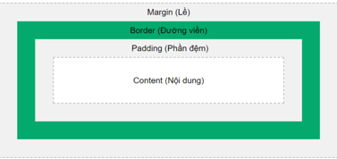
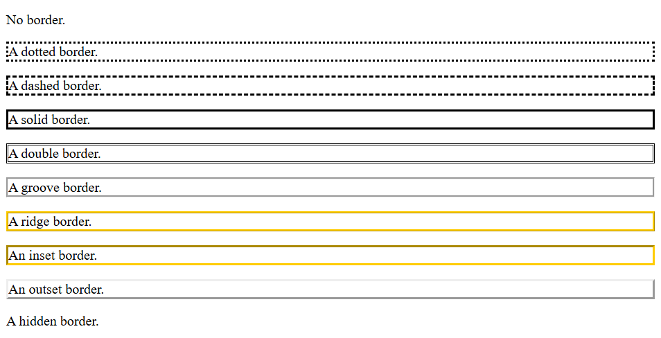

# Phần 1: CSS Cơ bản
## I. CSS selectors: Khái niệm, cú pháp 
 - CSS (Cascading Style Sheets). Là ngôn ngữ dùng để định dạng kiểu hiển thị cho các phần tử HTML.
 - CSS được sử dụng cùng với HTML và JavaScript trong hầu hết các trang web để tạo giao diện người dùng cho các ứng dụng web và giao diện người dùng cho nhiều ứng dụng di động.


 - Cú pháp:
 ```css
 selector{
    property: value;
 }
 ```
 - Trong đó:
     - selector: Bộ chọn cho biết phần tử HTML bạn muốn tạo kiểu cách. Nó có thể là bất kỳ thẻ nào như `<h1>`, `<title>`,...
     - property: Được gọi là một kiểu của thuộc tính của phần tử HTML. Nó có thể là color, border,...
     - value: Các giá trị được gán cho thuộc tính CSS. 
 - Ví dụ:
  ```css
  h1{
    color: red; 
    front-size:11px;
  }
  ```
 - Bộ chọn CSS được chia thành 5 loại:
     - Simple selectors (Bộ chọn đơn giản)
     - Combinator selectors (Bộ chọn tổ hợp)
     - Pseudo-class selectors (Bộ chọn lớp giả)
     - Pseudo-elements selectors (Bộ chọn phần tử giả)
     - Attribute selectors (Bộ chọn thuộc tính)
 - Các loại CSS Selector cơ bản:
 
| **Loại Selector**   | **Mô tả**                                     | **Ví dụ**                       |
| ------------------- | --------------------------------------------- | ------------------------------- |
| Element selector        | Áp dụng cho toàn bộ thẻ HTML cùng loại        | `p { color: red; }`             |
| Class selector      | Áp dụng cho các phần tử có class cụ thể (tên class ko bắt đầu bằng số) - hay dùng nhất       | `.menu { font-size: 18px; }`    |
| ID selector         | Áp dụng cho phần tử có id cụ thể (duy nhất)   | `#header { background: blue; }` |
| Universal selector (Bộ chọn chung)  | Áp dụng cho tất cả các phần tử                | `* { text-align: center; }`              |
| Group selector (Bộ chọn theo nhóm)     | Gộp nhiều selector có cùng thuộc tính và giá trị lại                        | `h1, h2, p { color: green; }`   |

## II. 3 kiểu chèn CSS

### 1. Inline CSS
 - 	Chèn trực tiếp trong thẻ HTML bằng thuộc tính style.
```html
<h1 style="color: blue;">Tiêu đề</h1>
```

### 2. Internal CSS
 - Chèn trong cặp thẻ `<style>` trong phần `<head>` của tài liệu HTML.
```html
<head>
  <style>
    p {
      font-size: 16px;
      color: red;
    }
  </style>
</head>
```

### 3. External CSS
 - Tạo file .css riêng và liên kết với HTML qua thẻ `<link>`. 
 - HTML:
``` html
<link rel="stylesheet" href="style.css">
```
 - style.css
```css
body {
  background-color: #f0f0f0;
}
```
 - Inline chỉ nên dùng tạm thời hoặc test nhanh.

 - Internal phù hợp với tài liệu đơn, nhỏ.

 - External là cách tốt nhất, giúp tách biệt nội dung và kiểu dáng, dễ bảo trì.
## III. Colors, Backgrounds, Height, Width, Z-index, Overflow, Opacity
### 1. Colors
 - Sử dụng theo mã Hex
### 2. Backgrounds

| Thuộc tính CSS             | Mô tả                                                                 | Ví dụ                                             |
|----------------------------|----------------------------------------------------------------------|---------------------------------------------------|
| `background-color`         | Đặt màu nền cho phần tử.                                             | `background-color: red;`                    |
| `background-image`         | Đặt hình nền bằng ảnh.                                               | `background-image: url("image.jpg");`             |
| `background-repeat`        | Xác định việc lặp lại hình nền.                                      | `background-repeat: no-repeat;`                   |
| `background-position`      | Xác định vị trí hiển thị hình nền.                                   | `background-position: center center;`             |
| `background-size`          | Điều chỉnh kích thước hình nền.                                      | `background-size: cover;`                         |
| `background-attachment`    | Quyết định hình nền có cuộn theo nội dung không.                     | `background-attachment: fixed;`                   |
| `background-origin`        | Xác định điểm bắt đầu vẽ hình nền (padding-box, border-box, content-box). | `background-origin: content-box;`           |
| `background-clip`          | Xác định vùng mà hình nền được vẽ lên.                              | `background-clip: padding-box;`                   |
| `background-blend-mode`    | Trộn màu nền với ảnh nền (blend effect).                            | `background-blend-mode: multiply;`                |
| `background` (shorthand)   | Viết tắt tất cả các thuộc tính trên trong một dòng.                 | `background: url("img.jpg") no-repeat center / cover lightblue;` |

 - Viết tắt với background shorthand
 ```css
 background: [color] [image] [position] / [size] [repeat] [attachment] [origin] [clip];
```
 - ví dụ:
```css
background: #ffcc00 url("con-lon.jpg") center / cover no-repeat fixed padding-box content-box;
```
 ->  Không cần ghi đủ hết, chỉ cần ghi đúng thứ tự nếu dùng shorthand.
 - Các giá trị thường gặp và cách dùng
     - background-repeat

    | Giá trị     | Kết quả                              |
    | ----------- | ------------------------------------ |
    | `repeat`    | (mặc định) Lặp cả chiều ngang và dọc |
    | `no-repeat` | Không lặp                            |
    | `repeat-x`  | Lặp theo chiều ngang                 |
    | `repeat-y`  | Lặp theo chiều dọc                   |

     - background-size

    | Giá trị     | Kết quả                                                         |
    | ----------- | --------------------------------------------------------------- |
    | `auto`      | Giữ nguyên kích thước ảnh                                       |
    | `cover`     | Phủ kín vùng nền, **có thể bị cắt ảnh**                         |
    | `contain`   | Co ảnh vừa vùng nền, **không cắt nhưng có thể dư khoảng trắng** |
    | `100% 100%` | Co ảnh khít vùng, **có thể bị méo nếu không đúng tỉ lệ**        |
     - background-attachment

    | Giá trị  | Ý nghĩa                               |
    | -------- | ------------------------------------- |
    | `scroll` | Ảnh nền cuộn theo nội dung (mặc định) |
    | `fixed`  | Ảnh nền đứng yên khi cuộn trang       |
    | `local`  | Cuộn theo phần tử (ít dùng hơn)       |

### 3.  Height, Width, Z-index, Overflow, Opacity
| Thuộc tính | Ý nghĩa ngắn gọn                                                                  |
| ---------- | --------------------------------------------------------------------------------- |
| `height`   | Chiều cao của phần tử                                                             |
| `width`    | Chiều rộng của phần tử                                                            |
| `z-index`  | Xác định thứ tự chồng lớp (cao hơn sẽ nằm trên) – chỉ hoạt động khi có `position` (-static) |
| `overflow` | Xử lý nội dung vượt ra ngoài (`visible`: khi chiều cao của box không đủ chứa text thì text vẫn hiển thị và bị tràn, `hidden`: text bị tràn bị ẩn đi, `scroll`, `auto`)              |
| `opacity`  | Độ mờ (0 = trong suốt hoàn toàn, 1 = hiển thị hoàn toàn)                          |

## IV. Box Model, Borders, Padding, Margins
### 1. Box Model (mô hình hộp)
 - Tất cả các element có thể được coi là các hộp gồm : lề, đường viền, phần đệm, nội dung
 - Box Model mô tả cấu trúc của một phần tử HTML như một hộp gồm 4 phần từ trong ra ngoài:

### 2. Border
#### a, CSS `border-style: `
| Giá trị   | Mô tả |
|-----------|-------|
| `none`    | Không có đường viền. |
| `dotted`  | Đường viền là các dấu chấm. |
| `dashed`  | Đường viền là các nét đứt. |
| `solid`   | Đường viền liền mạch. |
| `double`  | Hai đường viền song song có cùng độ rộng. |
| `groove`  | Đường viền có hiệu ứng rãnh 3D (groove), phụ thuộc vào `border-color`. |
| `ridge`   | Đường viền có hiệu ứng gờ nổi 3D (ridge), phụ thuộc vào `border-color`. |
| `inset`   | Đường viền tạo cảm giác chìm vào trong (inset), phụ thuộc vào `border-color`. |
| `outset`  | Đường viền tạo cảm giác nổi ra ngoài (outset), phụ thuộc vào `border-color`. |
| `hidden`  | Đường viền bị ẩn (giống `none` nhưng vẫn chiếm không gian). |



#### b, CSS `border-color: `
#### c, CSS `border-width: `
 - Sử dụng để chỉ định chiều rộng của đường viền. Nó được thiết lập bằng pixel. Bạn cũng có thể sử dụng một trong ba giá trị được định nghĩa trước như thin, medium hoặc thick để chỉ định chiều rộng của đường viền.
 ```
 border-width: 5px;
 border-width: medium;
 ```
#### d, CSS `border-radius: `
 - được sử dụng để bo tròn các góc của đường viền. Nó được thiết lập bằng pixel. 
```
border-radius: 10px;
```
#### e, CSS border
-  sử dụng để thiết lập đường viền bao gồm cả 3 giá trị của border-width, border-style và border-color. Các giá trị này được ngăn cách bởi dấu cách.
```
border: border-width border-style border-color
```
### 3.Padding
 - Tạo ra khoảng trống xung quanh nội dung, nằm trong đường viền
 - Ví dụ:
```css
div{
  padding-top: 50px;
  padding-right: 30px;
  padding-bottom: 50px;
  padding-left: 80px;
}

div{
  padding 25px;
}

div{
  padding 25px 50px;
}
```

### 3. Margins
 - Tạo khoảng cách giữa element này với element khác. Margin nằm bên ngoài border.

## V. Text, Fonts, Icons, List, Table
### 1. Text
| Thuộc tính         | Mô tả |
|--------------------|------|
| `color`            | Thiết lập màu cho văn bản. |
| `direction`        | Thiết lập hướng văn bản (`ltr` – trái sang phải, `rtl` – phải sang trái). |
| `letter-spacing`   | Thêm hoặc bớt khoảng cách giữa các chữ cái trong một từ. |
| `word-spacing`     | Tăng hoặc giảm khoảng cách giữa các từ trong một câu. |
| `text-indent`      | Tạo độ thụt đầu dòng cho văn bản trong đoạn văn. |
| `text-align`       | Căn chỉnh văn bản (ví dụ: `left`, `center`, `right`, `justify`). |
| `text-decoration`  | Thêm gạch chân, gạch giữa, gạch trên, hoặc bỏ đi gạch (`none`, `underline`, `line-through`, `overline`). |
| `text-transform`   | Chuyển văn bản thành chữ hoa, chữ thường hoặc viết hoa chữ cái đầu (`uppercase`, `lowercase`, `capitalize`). |
| `white-space`      | Điều khiển hiển thị khoảng trắng và xuống dòng (`normal`, `nowrap`, `pre`, v.v.). |
| `text-shadow`      | Thêm bóng cho văn bản. Cú pháp: `horizontal vertical blur color`. |

### 2. Fonts
| Thuộc tính       | Mô tả                                                    | Ví dụ                                                |
|------------------|----------------------------------------------------------|-------------------------------------------------------|
| `font-family`    | Thay đổi kiểu chữ (tên font chính và font dự phòng).     | `font-family: Arial, sans-serif;`                    |
| `font-style`     | Thiết lập kiểu chữ thường, nghiêng (`italic`) hoặc chếch (`oblique`). | `font-style: italic;`                            |
| `font-variant`   | Tạo chữ hoa nhỏ (small-caps).                             | `font-variant: small-caps;`                          |
| `font-weight`    | Độ đậm của chữ: `normal`, `bold`, `lighter`, `bolder`, hoặc số (100–900). | `font-weight: bold;`                      |
| `font-size`      | Kích thước chữ: px, %, em, rem, v.v.                      | `font-size: 16px;`                                   |
| `font`           | Shorthand để viết gộp các thuộc tính trên (trừ `font-variant`). | `font: italic bold 16px Arial, sans-serif;`     |

 - ví dụ:
```html
<p style="font: italic bold 20px 'Times New Roman', serif;">
  Đây là một đoạn văn bản có thiết lập đầy đủ font.
</p>
```
### 3. Icons
 - Icons là biểu tượng nhỏ được dùng để minh họa, trang trí, hoặc thể hiện chức năng trong giao diện người dùng. Thường gặp nhất là biểu tượng như 🔍 (search), 🗑️ (delete), ✉️ (mail)...
 - Cách sử dụng Icons trong HTML/CSS:
   -  Cách 1: Dùng Font Awesome (phổ biến nhất):
  ```html
  <!-- Thêm vào phần <head> -->
  <link rel="stylesheet" href="https://cdnjs.cloudflare.com/ajax/libs/font-awesome/6.4.0/css/all.min.css">

  <!-- Dùng icon trong body -->
  <i class="fa-solid fa-house"></i>            <!-- Icon ngôi nhà -->
  <i class="fa-solid fa-trash"></i>            <!-- Icon thùng rác -->
  <i class="fa-solid fa-user"></i>             <!-- Icon người dùng -->
  <i class="fa-solid fa-magnifying-glass"></i> <!-- Icon kính lúp -->
  ```
  ```css
  /* CSS tùy chỉnh icon */
  i {
    font-size: 24px;
    color: blue;
    margin-right: 10px;
  }
  ```
   - Cách 2: Dùng Unicode Symbols:
  ```html
  <p>📞 Điện thoại</p>
  <p>✉️ Email</p>
  <p>🔍 Tìm kiếm</p>
  ```
   - Cách 3: Dùng hình ảnh icon hoặc SVG:
  ```html
  
  
  ```
 | Cách dùng    | Ưu điểm                       | Nhược điểm                         |
| ------------ | ----------------------------- | ---------------------------------- |
| Font Awesome | Đẹp, nhiều icon, dễ tùy chỉnh | Cần internet hoặc tải file         |
| Unicode      | Nhanh, không cần file ngoài   | Ít icon, khó chỉnh kích thước/màu  |
| Ảnh / SVG    | Tùy chỉnh được, rõ nét        | Phải tải file và quản lý đường dẫn |

### 4. List
| **Thuộc tính**           | **Chức năng**                                                               | **Ví dụ minh họa**                             |
| ------------------------ | --------------------------------------------------------------------------- | ---------------------------------------------- |
| `list-style-type`        | Thiết lập kiểu dấu đầu dòng (bullet): `disc`, `circle`, `square`, `decimal` | `list-style-type: square;`                     |
| `list-style-position`    | Xác định vị trí của các điểm đánh dấu mục: `inside` (các điểm đánh dấu nằm bên trong) hoặc `outside` (bên ngoài) | `list-style-position: inside;`                 |
| `list-style-image`       | Dùng hình ảnh làm marker thay cho bullet hoặc số                            | `list-style-image: url('bullet.png');`         |
| `list-style`             | Rút gọn 3 thuộc tính trên thành một dòng                                    | `list-style: square inside url('bullet.png');` |


### 5. Table
 - Cấu trúc và kiểu bảng

 | Thuộc tính        | Ý nghĩa                                                              |
| ----------------- | -------------------------------------------------------------------- |
| `border`          | Thiết lập viền bảng và ô                                             |
| `border-collapse` | Gộp viền các ô lại (`collapse`) hay tách riêng (`separate`)          |
| `border-spacing`  | Khoảng cách giữa các ô khi `border-collapse: separate`               |
| `table-layout`    | Xác định cách bảng bố trí chiều rộng: `auto` (mặc định) hoặc `fixed` |
| `width`, `height` | Kích thước của bảng                                                  |

 - Canh lề và khoảng cách trong ô
  
  | Thuộc tính       | Ý nghĩa                                |
  | ---------------- | -------------------------------------- |
  | `padding`        | Khoảng cách giữa nội dung và viền ô    |
  | `text-align`     | Canh lề ngang cho nội dung trong ô     |
  | `vertical-align` | Canh lề dọc: `top`, `middle`, `bottom` |

 - Màu sắc và kiểu nền

 | Thuộc tính         | Ý nghĩa                      |
| ------------------ | ---------------------------- |
| `background-color` | Màu nền cho bảng hoặc từng ô |
| `color`            | Màu chữ                      |

 - Hiệu ứng và kiểu chữ

 | Thuộc tính    | Ý nghĩa                       |
| ------------- | ----------------------------- |
| `font-size`   | Kích thước chữ                |
| `font-weight` | Độ đậm chữ (`normal`, `bold`) |
| `hover`       | Hiệu ứng khi rê chuột         |
 
 - Tùy chỉnh tiêu đề bảng
```css
th {
    background-color: #333;
    color: white;
    font-weight: bold;
}
```
## VI. Display (inline, block, none)
 - `display: inline;` (không đặt được chiều rộng và chiều cao, không thêm được margin và padding cho bên trên và bên dưới)
 - `display: block;` (Chiều rộng kéo dài từ trái sang phải, luôn bắt đầu ở một hàng mới. Cho phép đặt chiều rộng và chiều cao, cho phép đặt margin, padding cho bên trên và bên dưới)
 - `display: inline-block;` (Chiều rộng mặc định bằng chiều rộng của element, không bắt đầu ở một hàng mới. Cho phép đặt chiều rộng và chiều cao, cho phép đặt margin, padding cho bên trên và bên dưới)
 - `display: none;` (Ẩn đi hoàn toàn)
 - `visibility: hidden;` // Ẩn nhưng vẫn chiếm một khoảng trống
 - `visibility: visible;` // Hiển thị. mặc định.


## VII. Position (static, fixed, realative, absolute, sticky, ...)
 - `position: static;` // Vị trí ở trạng thái mặc định của phần tử (tức là các thuộc tính top, bottom, right, left không có hiệu lực)
 - `position: relative;` // Vị trí tương đối so với vị trí mặc định và áp dụng được các thuộc tính top, right, bottom, left.
 - `position: absolute;` // Vị trí tuyệt đối cho các thành phần theo thành phần bao ngoài hoặc cửa sổ trình duyệt.
 - `position: fixed;` // Được định vị so với khung nhìn (viewport), có nghĩa là nó luôn ở một vị trí cố định ngay cả khi trang được cuộn. Các thuộc tính top, right, bottom và left được sử dụng để định vị element.
 - `position: sticky;` // Có thể hiểu đơn giản là sự kết hợp của `position: relative` và `position: fixed`. Nó cũng na ná relative nhưng mà khi các bạn scroll đến vị trí của nó sẽ giống hệt như fixed và khi các bạn scroll lên ra khỏi nó thì nó sẽ quay lại vị trí ban đầu dưới dạng relative.

## VIII. Combinator selectors (Bộ chọn tổ hợp)
### 1. Adjacent sibling selectors (Bộ chọn anh chị em liền kề)
 - Chọn phần tử tag02 được đặt cùng cấp và phải kề ngay sau phần tử tag01 (mỗi tag01 chỉ có một tag02 kề ngay sau).
 - Cú pháp: `tag01 + tag02`
### 2. General sibling selectors (Bộ chọn anh chị em chung)
 - Chọn tất cả phần tử tag02 cùng cấp với phần tử tag01, và những phần tử tag02 phải nằm sau phần tử tag01.
 - Cú pháp: `tag01 ~ tag02`
### 3. Child selectors (Bộ chọn con)
 - Chọn tất cả phần tử tag02 là cấp con đầu tiên (cấp 1) của phần tử tag01.
 - Cú pháp: `tag01 > tag02` 
### 4. Descendant selectors (Bộ chọn hậu duệ)
 - Chọn tất cả phần tử tag02 bên trong phần tử tag01.
 - Cú pháp: `tag01 tag02`
## IX. "Pseudo-elements Pseudo-classes"
### 1. Pseudo-class selectors (Bộ chọn lớp giả)
 - Dùng để xác định trạng thái đặc biệt của một element.
 - Cú pháp:
```css
selector:pseudo-class {
	property: value;
}
```
 - Một số pseudo-class phổ biến:
   - `:link`: khi liên kết chưa được truy cập lần nào. (Chỉ dùng cho thẻ a)
   - `:visited`: khi liên kết đã được truy cập sau lần đầu tiên. (Chỉ dùng cho thẻ a)
   - `:hover`: khi di chuyển chuột lên element.
   - `:active`: khi phần tử được click vào, áp dụng cho tất cả các thẻ.
   - `:first-child`: thiết lập thuộc tính cho element đầu tiên.
   - `:last-child`: thiết lập thuộc tính cho element cuối cùng.
   - `:nth-child(n)`: n có thể là các giá trị even (chẵn), odd (lẻ), một số, một biểu thức (an + b).

### 2. Pseudo-element selectors (Bộ chọn phần tử giả)
- Được sử dụng để tạo ra một phần tử giả và định kiểu (style) cho phần tử giả đó mà không cần tạo ra một phần tử thật.
 - Cú pháp:
```css
selector::pseudo-element {
	property: value;
}
```
 - Danh sách pseudo-element:
   - `::before`: Chèn nội dung nào đó trước nội dung của mỗi element. (Phải thêm content: ""; )
   - `::after`: Chèn nội dung nào đó sau nội dung của mỗi element. (Phải thêm content: ""; )
   - `::first-letter`: Chọn chữ cái đầu tiên của mỗi element.
   - `::first-line`: Chọn dòng đầu tiên của mỗi element.
   - `::marker`: Chọn các điểm đánh dấu của các mục danh sách (thẻ `<ul>` và `<ol>`)
   - `::selection`: Được dùng để style cho một vùng văn bản được người dùng chọn (hay còn gọi là "bôi đen"). Chỉ có một số thuộc tính css khả dụng với `::selection` là `color`, `background`, `cursor`, và `outline`.


## X. Relative & Absolute Units (rem, em, cm, px, ...)
 - Độ dài tương đối: Là đơn vị đo lường được sử dụng trong CSS ở mức tương đối, thường phụ thuộc vào 1 thành phần nào đó thì mới xác định được giá trị của nó.

| **Loại đơn vị** | **Đơn vị** | **Ý nghĩa / Mô tả**                                                              | **Ví dụ**            |
| --------------- | ---------- | -------------------------------------------------------------------------------- | -------------------- |
| 🔸 Tương đối    | `em`       | Dựa trên **kích thước font của phần tử cha**                                     | `font-size: 2em;`    |
|                 | `rem`      | Dựa trên **kích thước font của phần tử `html` (gốc)**                            | `font-size: 1.5rem;` |
|                 | `%`        | Dựa trên **giá trị của phần tử cha**, thường dùng cho **width, height, padding** | `width: 50%;`        |
|                 | `vw`       | 1% chiều rộng của **viewport (trình duyệt)**                                     | `font-size: 5vw;`    |
|                 | `vh`       | 1% chiều cao của **viewport**                                                    | `height: 50vh;`      |
|                 | `vmin`     | Giá trị nhỏ hơn giữa `vw` và `vh`                                                | `width: 10vmin;`     |
|                 | `vmax`     | Giá trị lớn hơn giữa `vw` và `vh`                                                | `width: 10vmax;`     |

 - Độ dài tuyệt đối: Là loại đơn vị có giá trị cố định và thể hiện chính xác chiều dài kích thước nó hiển thị, không phụ thuộc cũng như không thay đổi bởi bất kỳ tác động bên ngoài nào.
  
  | **Loại đơn vị** | **Đơn vị** | **Ý nghĩa / Mô tả**                                  | **Ví dụ**          |
  | --------------- | ---------- | ---------------------------------------------------- | ------------------ |
  | 🔹 Tuyệt đối    | `px`       | Pixel – điểm ảnh trên màn hình (phổ biến và ổn định) | `font-size: 16px;` |
  |                 | `pt`       | Point – 1pt = 1/72 inch (thường dùng trong in ấn)    | `font-size: 12pt;` |
  |                 | `cm`       | Centimeter – cm thực tế ngoài đời                    | `width: 5cm;`      |
  |                 | `mm`       | Millimeter – mm thực tế                              | `height: 30mm;`    |
  |                 | `in`       | Inch – 1in = 2.54cm = 96px                           | `width: 1in;`      |
  |                 | `pc`       | Pica – 1pc = 12pt                                    | `font-size: 1pc;`  |

 - Dùng `rem` để đảm bảo tính nhất quán và dễ quản lý toàn trang.

 - Dùng `em` cho các thành phần con, giúp chúng co giãn theo cha.

 - Dùng `px` khi cần kiểm soát chính xác kích thước (nhưng kém linh hoạt).

 - Dùng `vw`, `vh` để thiết kế giao diện đáp ứng theo màn hình (responsive).

 - Tránh dùng `cm, in, pt` khi làm web, chủ yếu dùng cho in ấn.

## XI. !important
 - Important được sử dụng để thay đổi thứ tự ưu tiên của CSS, khi một thuộc tính CSS nào đó được gán lệnh Important thì đồng nghĩa với việc nó sẽ có mức ưu tiên cao nhất. Nếu có nhiều thuộc tính cùng có !important thì lại quay về bài toán tính độ ưu tiên.
 - Ví dụ:
   - h2 { color: red!important; }
## XII. Math Functions
 - Các hàm toán học CSS cho phép các biểu thức toán học được sử dụng làm giá trị thuộc tính.
 - Các hàm toán học:
  `Hàm calc()`
   - Thực hiện một phép tính, kết quả sẽ lấy làm giá trị thuộc tính. Các toán tử sau có thể được sử dụng: + – * /
   - Ví dụ: width: calc(100% - 100px);
  
   `Hàm max()`
   - Sử dụng giá trị lớn nhất, từ danh sách giá trị được phân tách bằng dấu phẩy, làm giá trị thuộc tính.
   - Cú pháp: max(value1, value2, …)
   - Ví dụ: width: max(50%, 300px);

   `Hàm min()`
   - Sử dụng giá trị nhỏ nhất, từ danh sách giá trị được phân tách bằng dấu phẩy, làm giá trị thuộc tính.
   - Cú pháp: min(value1, value2, …)
   - Ví dụ: width: min(50%, 300px);


## XIII. Variables, Box Sizing, Reset CSS
### 1. Variables (biến)
 - Mục đích của khai báo biến là để có thể sử dụng được ở nhiều nơi.
 - Kiểu global (toàn cục): có thể sử dụng được nhiều nơi trong file css.
 - Kiểu local (cục bộ): chỉ sử dụng được ở trong phạm vi của nó, những đoạn css khác không sử dụng được.
 - Cách tạo biến global:
```css
:root {
    --ten-bien: giá trị;
}
```
 - Cách sử dụng biến:
```css
var(--ten-bien);
```
 -  ví dụ:
```css
:root {
    --gray: #333333;
    --white: #ffffff;
}
body {
    color: var(--gray);
    background-color: var(--white);
}
```
 - Cách tạo biến local:
```css
selector {
    --ten-bien: giá trị;
}
```
 - Cách sử dụng biến:
```css
selector {
    --ten-bien: giá trị;
    var(--ten-bien);
}
```
 - ví dụ:
```css
h1 {
    --local-color: blue;
    color: var(--local-color);
}
p {
    color: var(--local-color);
}
```
### 2. Box Sizing (Kích thước hộp)
 - Mặc định khi ta sử dụng thuộc tính width, height thì chỉ là áp dụng cho phần content của 1 element.
 - 2 loại box-sizing:
   - content-box: 
     - Mặc định. Width/height chỉ bao gồm “nội dung” của phần tử.
     - width, height = content
   - border-box:
     - Width/height bao gồm: content, padding, border của phần tử.
     - width, height = content + padding + border.
### 3. Reset CSS
 - Reset CSS là một đoạn mã CSS được sử dụng để đặt lại (reset) tất cả các thuộc tính mặc định mà trình duyệt gán cho các thẻ HTML, giúp tạo ra sự đồng nhất về giao diện trên các trình duyệt khác nhau.
 - Các cách Reset phổ biến
 
 | Loại reset             | Mô tả                                                                          | Ví dụ                                                                                                     |
| ---------------------- | ------------------------------------------------------------------------------ | --------------------------------------------------------------------------------------------------------- |
| **Basic Reset**        | Reset đơn giản một số thẻ phổ biến                                             | `* { margin: 0; padding: 0; box-sizing: border-box; }`                                                    |
| **Eric Meyer’s Reset** | Phổ biến nhất, reset rất nhiều thẻ                                             |                                                                                              |
| **Normalize.css**      | Không reset mà **giữ lại giá trị mặc định hợp lý**, chỉ sửa những gì khác biệt | `normalize.css` tải từ [https://necolas.github.io/normalize.css](https://necolas.github.io/normalize.css) |
