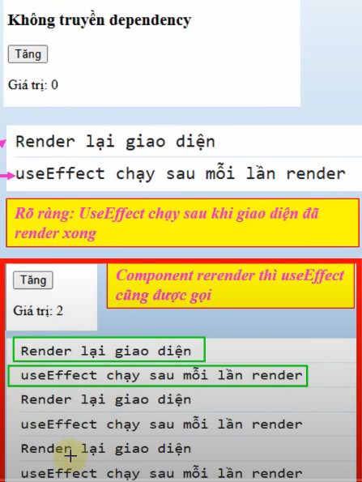

# BUỔI 6: REACT FUNDAMENTALS

## PHẦN 1: CÀI ĐẶT, MÔI TRƯỜNG, KIẾN THỨC CƠ BẢN

### 1. Giới thiệu React

**React là gì?**
React (hay React.js) là một thư viện JavaScript mã nguồn mở được phát triển bởi Facebook (Meta) vào năm 2013. React được sử dụng để xây dựng giao diện người dùng (User Interface - UI), đặc biệt là các ứng dụng web single-page application (SPA).

**Đặc điểm chính của React:**

**1. Component-Based (Dựa trên Component):**
- Chia nhỏ giao diện thành các component độc lập, có thể tái sử dụng
- Mỗi component quản lý state (trạng thái) riêng của nó
- Dễ dàng bảo trì và phát triển

**2. Virtual DOM:**
- React sử dụng Virtual DOM thay vì thao tác trực tiếp với DOM thật
- Virtual DOM là bản sao nhẹ của DOM thật trong bộ nhớ
- Khi có thay đổi, React so sánh Virtual DOM cũ và mới, chỉ cập nhật những phần khác biệt
- Giúp tăng hiệu suất đáng kể

**3. JSX (JavaScript XML):**
- Cú pháp mở rộng cho JavaScript, cho phép viết HTML trong JavaScript
- Làm cho code dễ đọc và viết hơn
- Được biên dịch thành JavaScript thuần túy

**4. One-Way Data Flow (Luồng dữ liệu một chiều):**
- Dữ liệu chảy từ component cha xuống component con thông qua props
- Giúp dễ dàng debug và theo dõi luồng dữ liệu

**Ví dụ đơn giản về React Component:**
```jsx
function Welcome(props) {
  return <h1>Hello, {props.name}!</h1>;
}

// Sử dụng component
<Welcome name="Alice" />
// Kết quả: <h1>Hello, Alice!</h1>
```

**React vs Vanilla JavaScript:**
- **Vanilla JS:** Thao tác trực tiếp với DOM, phức tạp khi ứng dụng lớn
- **React:** Quản lý state tự động, component hóa, dễ bảo trì

**Ai đang sử dụng React?**
- Facebook, Instagram, Netflix, Airbnb, Uber, WhatsApp, Dropbox
- Hàng nghìn công ty và dự án trên toàn thế giới

### 2. Cài đặt môi trường
**vite**
 - Bước 1: Cài Node.js
 - Bước 2: Mở Terminal
   - Gõ lệnh `npm create vite@latest`
     - Nếu bị lỗi: mở powershell gõ lệnh `Set-ExecutionPolicy RemoteSigned`
     - ấn `y`
     - Ra terminal chạy lại lệnh trên
 - Bước 3: Đặt tên project
 - Bước 4: Chọn React
 - Bước 5: Chọn Javascript
 - Bước 6: Chạy theo 3 lệnh yêu cầu
**cra**
1. Cài đặt Node.jsjs
2. Tạo 1 folder để chứa project React, vào trong folder đè shift nhấn chuột phải.

3. Tiếp theo gõ các dòng lệnh sau để tạo project
```html
npm install -g create-react-app
create-react-app my-app 
```

NPM sẽ tự động tạo cho ta 1 project tên là my-app và install các module và lib cần thiết cho chúng ta.

4. Vào thư mục src xóa hết các file trong đây, lưu ý không xóa cả thư src mà chỉ xóa các file ở trong đó.

5. Sau đó tạo mới 2 file, **Index.js** và **App.js**,.
Trong **App.js** các bạn code như sau: import React from 'react';
```js
class App extends React.Component {
   render() {
      return (
         <div>
            Hello World!!!
         </div>
      );
   }
}
export default App;
```

Đây là React component đầu tiên của chúng ta, chúng ta sẽ tìm hiểu component là gì ở các bài sau, component này là App sẽ render Hello World ra màn hình. Tiếp theo trong **index.js** ta code:
```js
import React from 'react';
import ReactDOM from 'react-dom';
import App from './App.jsx';

ReactDOM.render(<App />, document.getElementById('root'));
```

Bạn thắc mắc không biết Id root ở đâu? Bạn để ý trong project mình có 1 thư mục là public, bạn mở nó ra thấy 1 file index.html mở nó ra và bạn sẽ thấy 1 div với id root như hình:

Đây là file HTML chính của ta, tất cả component sẽ được render ra đây.

6. Running the Server:
Các bạn mở cmd lên và gõ lệnh: npm start.
### 3. Lợi ích của React
 - Độ hot, nhiều người tiếp cận
 - Được đánh giá là thân thiện với SEO trong những Lib/FW JS (SEO - Search Engine Optimization)
 - Khả năng mở rộng tốt, tái sử dụng cao
 - Hiệu suất cao
 - Phát triển nhanh chóng
 - Khả năng tương thích ngược
 - Tương lai sáng
### 4. CLI Tools
**CLI Tools** là các công cụ dòng lệnh giúp tạo và quản lý dự án React một cách nhanh chóng, tự động hóa các bước cấu hình phức tạp.

#### 4.1. Create React App
Là công cụ chính thức của React để khởi tạo dự án. Chỉ cần một lệnh duy nhất, bạn sẽ có ngay một dự án React với cấu hình sẵn sàng để phát triển.
- **Cách dùng:**
  ```bash
  npx create-react-app ten-du-an
  ```
- **Ưu điểm:** Dễ dùng, phù hợp cho người mới bắt đầu.
- **Nhược điểm:** Khó tùy chỉnh cấu hình sâu.

#### 4.2. Vite
Là công cụ hiện đại, siêu nhanh để tạo dự án React. Vite sử dụng công nghệ mới giúp khởi động và build dự án rất nhanh.
- **Cách dùng:**
  ```bash
  npm create vite@latest
  ```
- **Ưu điểm:** Tốc độ cao, dễ tùy chỉnh, hỗ trợ nhiều framework.
- **Nhược điểm:** Tài liệu tiếng Việt còn ít, cần biết một chút về cấu hình.

**Tóm lại:**
- Nếu bạn mới học React, hãy bắt đầu với Create React App.
- Nếu muốn tốc độ và linh hoạt hơn, hãy thử Vite.

### 5. JSX
 - JSX viết tắt của từ Javascript XML. JSX là một phần mở rộng của ngôn ngữ JavaScript dựa trên ES6 và được dịch sang JavaScript thông thường trong thời gian chạy.
 - Nó cho phép bạn viết các đoạn mã HTML trong ReactJS một cách dễ dàng và có cấu trúc hơn.
#### Cú pháp JSX
 - Cú pháp của JSX cũng tương tự như XML.

**Ta có thẻ mở tag:**
```jsx
<JSXElementName JSXAttributesopt>
```
**Đóng tag:**
```jsx
</JSXElementName>
```
**Ở đây lưu ý tên của thẻ mở tag và đống tag phải giống nhau. ví dụ :**
```jsx
   <MyButton color="blue" shadowSize={2}>
      Click Me
    </MyButton>
```
**Ngoài ra JSX cũng có SelfClosingElement:**
```jsx
<JSXElementName JSXAttributes/>
```
ví dụ:
```jsx
<div className="sidebar" />
```

**chú ý** : JSX không phải là HTML do đó bạn nên cẩn thận kẻo nhầm với cú pháp của HTML nhé.

Ví dụ trong một div element, ta định nghĩa một Class container thì ta không viết là:
```jsx
<div class="container">...</div> 
mà phải viết là 
<div className="container">...</div>
```
(vì class là keyword của Javascript). Hoặc for trong label element thì phải viết thành htmlfor, ....

Ngoài ra HTML tag không cần đóng cũng được nhưng JSX cần thiết phải đóng tag nhé.

```jsx
<JSXElementName JSXAttributesopt>

# something here

</JSXElementName>
``` 
 - Một số khác biệt giữa HTML và JSX:

| Mô tả                          | Cấu trúc HTML                    | Cấu trúc JSX                       |
| ------------------------------ | -------------------------------- | ---------------------------------- |
| Tên Class                      | `<tag class="">`                 | `<tag className="">`               |
| Thuộc tính value của `<input>` | `<input value="">`               | `<input defaultValue="">`          |
| Thuộc tính `for` của `<label>` | `<label for="">`                 | `<label htmlFor="">`               |
| Giá trị của `<select><option>` | `<option value="">`              | `<option value={}>`                |
| Style trực tiếp bên trong tag  | `<tag style="width: 10%">`       | `<tag style={{ width: '10%' }}>`   |
| Event (sự kiện)                | `<tag onclick="functionName()">` | `<tag onClick={functionName}>`     |
| Khi gọi một biến               |                                  | ` Hello {name}!` |

 - Lưu ý:
   - Trong JSX chỉ viết được 1 element cha bọc ở bên ngoài.
   - Để viết được 2 element cha thì chúng ta dùng cú pháp Fragment.
Cú pháp: `<></>`.

**Biểu thức trong JSX:**
 - Với JSX, bạn có thể viết các biểu thức bên trong dấu ngoặc nhọn `{ }`
 - Biểu thức có thể là một biến React hoặc thuộc tính hoặc bất kỳ biểu thức JavaScript hợp lệ nào khác.
 - vidu:
`const myElement = <h1>React is {5 + 5} times better with JSX</h1>;`
**JSX cũng là biểu thức**

Sau khi biên dịch, biểu thức JSX trở thành các đối tượng JavaScript thông thường. Điều này có nghĩa là bạn có thể sử dụng JSX bên trong các câu lệnh if và cho các vòng lặp, gán nó cho các biến, chấp nhận nó như các đối số, và trả về nó từ các hàm:
```jsx
function getGreeting(user) {
  if (user) {
    return <h1>Hello, {formatName(user)}!</h1>;
  }
  return <h1>Hello, Stranger.</h1>;
}
```
**Điều kiện - câu lệnh if**
 - React hỗ trợ các câu lệnh, nhưng không hỗ trợ bên trong JSX
 - Để có thể sử dụng các câu lệnh có điều kiện trong JSX, bạn nên đặt các câu lệnh bên ngoài JSX, hoặc bạn có thể sử dụng biểu thức bậc ba thay thế `if`
 - Lựa chọn 1: Viết các câu lệnh bên ngoài mã JSX
```
const x = 5;
let text = "Goodbye";
if (x < 10) {
  text = "Hello";
}

const myElement = <h1>{text}</h1>;
```
 - Lựa chọn 2: Thay vào đó, hãy sử dụng các biểu thức bậc ba:
```
const x = 5;

const myElement = <h1>{(x) < 10 ? "Hello" : "Goodbye"}</h1>;
```
### 6. Components
**Components** giúp phân chia các UI (giao diện người dùng) thành các phân nhỏ để dễ dàng quản lý và tái sử dụng. Components trong React thường được viết theo 2 loại chính đó là functional component và class components.  
 -  Trước khi thực hiện viết components, chúng ta nên khởi tạo một thư mục có tên components trong thư mục src để chứa tất cả các component trong dự án. Cấu trúc thư mục của dự án lúc này sẽ là:
```
public/
node_modules/
src/
-----components/
---------------Components sẽ viết ở trong thư mục này
-----App.js
-----index.js
---- vv....
packages.json
packages-lock.json
```
#### 6.1. Class Component
 - Cách viết này là cách viết đầy đủ của của một component, khi bạn viết một class component bạn sẽ sử dụng được hầu hết các chức năng của component như state, props, lifecycle,..
 - ví dụ:
```jsx
import React, { Component } from "react";
class Welcome extends Component {
  render() {
    return (
      <div>
        <h1>Welcome ! I am a class component </h1>
      </div>
    );
  }
}
export default Welcome; 
```

Bạn có thể thấy, **class ExampleComponent** kế thừa **Component**, vì vậy React hiểu class này là một component, và nó renders (returns) 1 React Element.

Vì vậy, một React class component là:

- là một class ES6, nó sẽ là một component khi nó "kế thừa" React **component**.
- có thể nhận **props** (trong hàm khởi tạo) nếu cần.
- có thể maintain data của nó với **state**
- phải có 1 method **render()** trả về 1 React element (JSX), or null
Khi bạn muốn làm việc với với các chức năng của component như events, state, lifce cycles hay tổ chức các đoạn code theo cấu trúc theo mô hình OOP thì bạn có thể cân nhắc sử dụng class components. 
#### 6.2. Function Component
 - Đây là cách viết phổ biến và được sử dụng nhiều nhất trong các dự án mà mình viết, bởi tính nhanh gọn và không quá phức tạp như các viết class component. 
 - Tiến hành tạo một file có tên Welcome.js trong thư mục src/components:
```jsx
//Import react vào trong dự án
import React from "react";
 
const Welcome = function(props) {
  return (
    <div>
      <h1>Welcome ! I am a functional component </h1>
    </div>
  )
}
 
export default Welcome;
```
 - cuối file bạn cần phải export component này để file khác có thể lấy để sử dụng. 
 - import file Welcome.js vào trong file App.js và hiển thị nó ra
```jsx
import React from 'react';
import Welcome from './components/Welcome'
function App() {
  return (
    <div>
        <Welcome />
        <p>freetuts.net</p>
    </div>
  );
}
 
export default App;
```
 - Funtion có thể nhận props làm tham số(nếu nó cần), nhưng chúng **bắt buộc** phải trả về **React element**.
 - Trong functional component thì sẽ không có các khái niệm như state, life cycles, events,...nhưng trong phiên bản gần đây thì React cũng đã hỗ trợ thêm React Hooks cho phép bạn làm việc với state, lifecycles dễ dàng hơn trong funcitonal components.
 - Bây giờ hầu như funcitonal component có hầu hết chức năng giống như class component nên bạn có thể cân nhắc sử dụng nó nhiều hơn.

### So sánh nhanh
- **Class Component:** Phù hợp khi cần quản lý state phức tạp hoặc dùng lifecycle.
- **Function Component:** Ngắn gọn, dễ viết, dùng hook để quản lý state và logic.

**Lưu ý:** Trong thực tế hiện nay, Function Component kết hợp với hook là lựa chọn phổ biến nhất.

### 7. List và Key
#### List
 - Việc khởi tạo các lists trong React, tương tự như khởi tạo lists trong Javascript. 
```jsx
import React from "react";
 
function ListComponent(props) {
  const myList = ["php", "javascript", "python", "C++"];
  const listItems = myList.map((item) =>
    <li>{item}</li>
  );
   
  return (
    <ul>{listItems}</ul>
  );
}
 
export default ListComponent
```
#### Key
 - Trong quá trình làm việc với React, chúng ta phải thao tác với danh sách(lists) rất nhiều như danh sách các ảnh, danh sách các item trong giỏ hàng,...Khi các lists này có hàng tá các items thì React rất khó có thể kiểm soát được items. Bởi vậy chúng ta cần phải chỉ định cho nó một key để định danh.

```jsx
import React from "react";
 
function ListComponent(props) {
  const myList = [
    {
      id : 'p',
      name : 'php'
    },
    {
      id : 'j',
      name : 'javascript'
    },
    {
      id : 'py',
      name : 'python'
    },
    {
      id : 'c',
      name : 'C++'
    },
  ]
 
  //Thêm thuộc tính key vào trong thẻ jsx
  const listItems = myList.map((item) =>
    <li key = {item.id}>{item.name}</li>
  );
 
  return (
    <ul>{listItems}</ul>
  );
}
 
export default ListComponent
```
 - Một vài lưu ý khi sử dụng Keys:
   - Keys là duy nhất, các keys này không được trùng lặp trong các lists.
   - Tránh chỉ định index làm key. Bởi khi bạn thực hiện sắp xếp mảng thì index sẽ thay đổi, React lại phải xác định lại keys môt lần nữa, gây ra giảm hiệu xuất làm việc.
   - Chỉ sử dụng index làm key trong khi:
     - Nếu list của bạn là tĩnh và sẽ không thay đổi.
     - List sẽ không bao giờ được sắp xếp lại.
     - List sẽ không được lọc (thêm / xóa các mục khỏi danh sách).
     - Không có id cho các mục trong list.
### 8. Props và State
#### Props (properties)
 - Props là một object được truyền vào trong một components, nó lưu trữ các giá trị của các attribute (thuộc tính) của một thẻ (Tag). mỗi components sẽ nhận vào props và trả về react element. Props cho phép chúng ta giao tiếp giữa các components với nhau bằng cách truyền tham số qua lại giữa các components.
 - Khi một components cha truyền cho component con một props thì components con chỉ có thể đọc và không có quyền chỉnh sửa nó bên phía components cha.
 - Cách truyền một props cũng giống như cách mà bạn thêm một attributes cho một element HTML.
```jsx
const App = () => <Welcome name="anhtran"></Welcome>
```
 - Trong ví dụ bên trên, component có tên Welcome sẽ nhận được giá trị của props có tên name vừa mới được truyền vào.
Hoặc ví dụ:
Ví dụ:
```jsx
function Welcome(props) {
  return <h1>Hello, {props.name}</h1>;
}

const element = <Welcome name="ReactJS" />;
ReactDOM.render(
  element,
  document.getElementById('root')
);
```
 - Trong đó, `name` ở `{props.name}` là property, `Welcome` là Component. Mỗi `property` của Component sẽ tương ứng với 1 attribute của thẻ, giá trị của attribute sẽ được truyền vào property của Component.
 - Với ví dụ trên, dòng `<Welcome name="ReactJS" />` tạo ra một Component `Welcome` và `attribute` có value là `ReactJS`, ở bên trên chúng ta có 1 function component trả về `Hello, {props.name}` và như vậy, {props.name} sẽ cho chúng ta giá trị là `ReactJS` mà Component `Welcome` truyền vào, và cuối cùng thì khi `render` sẽ ra đoạn : Hello, `ReactJS`. Giống như là 1 cách gọi hàm trong `javascript` đúng không nhỉ
#### State
 - State là một object có thể được sử dụng để chứa dữ liệu hoặc thông tin về components. State có thể được thay đổi bất cứ khi nào mong muốn.(dữ liệu động)
 - Khác với props bạn có thể truyền props sang các components khác nhau thì state chỉ tồn tại trong phạm vi của components chứa nó, mỗi khi state thay đổi thì components đó sẽ được render lại.
 - Để cập nhật lại 1 thành phần chúng ta sử dụng useState
   - useState nhận một giá trị khởi tạo (initState) làm đối số
   - Trả về một mảng gồm 2 phần tử: giá trị hiện tại của state và 1 hàm để cập nhật state đó
```jsx
import {useState} from "react"

const [state, setState] = useState(initState);
```
 - ví dụ quen thuộc
```jsx
const [count, setCount] = useState(0);

funtion updateCount() {
  setCount(count+1);
}
<button onClick={updateCount}>
  count is {count}
</button>

```
 - Khi sử dụng bắt buộc phải gọi useState tại cấp cao nhất của hàm thành phần. Không được gọi bên trong các câu lệnh if, while...
**Ứng dụng State để hiển thị dữ liệu thực**
// code Demo-React
### 9. Handling Event
 - Xử lý các sự kiện trong React rất giống với xử lý các sự kiện trên các phần tử DOM. Có một số khác biệt về cú pháp:
   - Các sự kiện React được đặt tên bằng camelCase, thay vì chữ thường. Ví dụ: onclick -> onClick, onchange -> onChange
   - Với JSX, bạn truyền một hàm để bắt sự kiện, thay vì một chuỗi như HTML thông thường.
 - Một điểm khác biệt nữa là bạn không thể sử dụng return false để chặn các hành động mặc định được (prevent default), trong React bạn cần phải sử dụng preventDefault(). 
 - ví dụ:
- HTML
``` 
<form onsubmit="console.log('form submit'); return false;">
    <div className="form-group">
        <label htmlFor="text">Email:</label>
        <input type="text" className="form-control" name="email" placeholder="Enter email" onChange={e=>
        this.changeInputValue(e)}
        />
    </div>
    <button type="submit" className="btn btn-primary">
        Submit
    </button>
    </div>
</form>
```
- JSX
```jsx
function ActionLink() {
    function submitForm(e) {
      e.preventDefault();
      console.log('form submit !!');
    }
   
    return (
     <form onSubmit = {(e) => submitForm(e)}>
         <button type="submit">Submit</button>
     </form>
    );
  }
```
 - Ở đây, e là một object chứa tất cá event. React định nghĩa object này theo W3C spec, vì vậy chúng ta không cần phải quan tâm về khả năng tương thích giữa các trình duyệt với nhau.

**Lưu ý với this trong xử lý Events**
 - Trong JavaScript, **class methods không được bind mặc định**. Nếu bạn quên bind `this.handleClick` và truyền nó vào `onClick`, thì `this` sẽ là `undefined` khi hàm được gọi.

 - Điều này **không phải** là hành vi riêng của React, mà là cách hàm hoạt động trong JavaScript. Nếu bạn truyền một method mà không có `()`, như `onClick={this.handleClick}`, bạn cần bind method đó.
### 10. Conditional Rendering
#### a, v-if
 - Chúng ta sử dụng v-if directive để render template theo một điều kiện nào đó.
```
<h1 v-if="ok">Yes</h1>
```
 - Nếu giá trị của ok là true thì thẻ h1 sẽ hiển thị, ngược lại thẻ h1 sẽ bị ẩn. Ngoài ra chúng ta cũng có thể bổ sung thêm lệnh v-else.
```
<h1 v-if="ok">Yes</h1>
<h1 v-else>NO</h1>
```
 - Vì v-if là một directive nên bản thân nó chỉ nằm trong một thẻ HTML duy nhất, vì vậy khi bạn muốn nhiều thẻ chịu tác dụng thì bắt buộc phải sử dụng một thẻ template bao bên ngoài và đặt v-if bên trong thẻ đó
#### b, v-else và v-else-if 
 - Cũng giống như lệnh if else, bạn có thể sử dụng bộ ba directives v-if, v-else, v-else-if để rẻ nhánh.
```
<div v-if="type === 'A'">
    A
</div>
<div v-else-if="type === 'B'">
    B
</div>
<div v-else-if="type === 'C'">
    C
</div>
<div v-else>
    Not A/B/C
</div>
```
## PHẦN 2: LIFECYCLE

### 1. useState Hook

**useState** là hook giúp quản lý state (trạng thái) trong function component.
- Khi gọi useState, bạn truyền vào giá trị khởi tạo. useState trả về một mảng gồm: giá trị hiện tại và hàm để cập nhật giá trị đó.
- Mỗi khi gọi hàm cập nhật, component sẽ render lại với giá trị mới.

**Ví dụ:**
```jsx
import React, { useState } from 'react';

function Counter() {
  const [count, setCount] = useState(0);
  return (
    <div>
      <p>Count: {count}</p>
      <button onClick={() => setCount(count + 1)}>Tăng</button>
    </div>
  );
}
```

**Lưu ý:**
- Không gọi useState trong vòng lặp, điều kiện, hoặc hàm lồng nhau. Chỉ gọi ở cấp cao nhất của function component.

---

### 2. useEffect Hook

**useEffect** là hook giúp thực hiện các "side effect" (tác động phụ) như gọi API, thao tác DOM, setTimeout, setInterval, hoặc lắng nghe sự thay đổi dữ liệu.
- Hiểu đơn giản, sau khi React đã render xong component. useEffect = " React ơi, sau khi render xong, hãy giúp tôi làm cái việc này nhé" (ví dụ: gọi APi, ...)
- Cách dùng cơ bản:
```
import {useEffect} from 'react'

useEffect (CallBack, [deps])
```

- useEffect nhận vào một hàm callback và một mảng phụ thuộc (dependency array). 
- Nếu ko có dependency, hàm callback chạy sau mỗi lần render.
- Nếu mảng phụ thuộc rỗng, effect chỉ chạy một lần sau khi component mount.
- Nếu có giá trị trong mảng, effect sẽ chạy mỗi khi giá trị đó thay đổi.

**Ví dụ:**
```jsx
import React, { useState, useEffect } from 'react';

function Timer() {
  const [count, setSCount] = useState(0);

  useEffect(() => {
    console.log("useEffect chayj sau mooix laanf render")
  }, []); // chỉ chạy 1 lần khi mount

  return (
    <div>
      <h3>Khong truyen dependency</h3>
      <button onClick={()=>setCount(count+1)}> Tăng </button>
      <p>Giá trị: {count}</p>
      {console.log("render lại giao diện)}
    </div>
  )
}
```


**Lưu ý:**
- Luôn cleanup các effect như setInterval, event listener để tránh rò rỉ bộ nhớ.
- Có thể dùng nhiều useEffect trong một component.

## PHẦN 3: COMPONENT VÀ QUẢN LÝ CẤU TRÚC FILE

### 1. Cấu trúc thư mục dự án

**Cấu trúc thư mục React cơ bản:**
```
my-app/
├── node_modules/
├── public/
│   └── index.html
├── src/
│   ├── components/
│   │   ├── Header.js
│   │   ├── Footer.js
│   │   └── ...
│   ├── App.js
│   ├── index.js
│   └── ...
├── package.json
└── ...
```
- Thư mục `components` chứa các file component riêng biệt để dễ quản lý, tái sử dụng.
- `App.js` là component gốc, nơi kết hợp các component con.

### 2. Tổ chức Components

- Mỗi component nên nằm trong file riêng, đặt tên theo chức năng (Header, Footer, ProductList, ...).
- Nếu component phức tạp, có thể tạo thêm thư mục con cho từng nhóm chức năng.
- Nên chia nhỏ component để dễ bảo trì, kiểm thử và tái sử dụng.

**Ví dụ:**
```
src/
├── components/
│   ├── Header/
│   │   ├── Header.js
│   │   └── Logo.js
│   ├── Footer/
│   │   └── Footer.js
│   └── Product/
│       ├── ProductList.js
│       └── ProductItem.js
```
#### Các loại component

| Loại Component          | Mô tả                                      | Ví dụ                           |
| ----------------------- | ------------------------------------------ | ------------------------------- |
| **Presentational (UI)** | Chỉ hiển thị UI, không chứa logic phức tạp | `Button`, `Header`, `Footer`    |
| **Container (Logic)**   | Chứa logic, quản lý state và gọi API       | `UserList`, `ProductPage`       |
| **Layout Component**    | Chứa layout chung cho nhiều trang          | `MainLayout`, `DashboardLayout` |
| **Shared Component**    | Component dùng lại nhiều nơi               | `Modal`, `Input`, `Card`        |

### 3. Cấu trúc dự án React

#### 3.1. Cấu trúc cơ bản (mặc định create-react-app)

```
my-app/
│
├── public/
│   ├── index.html
│   └── favicon.ico
│
├── src/
│   ├── App.js
│   ├── index.js
│   ├── App.css
│   └── ...
│
├── package.json
└── README.md
```

* **Ưu điểm:** Đơn giản, dễ bắt đầu.
* **Nhược điểm:** Khi dự án lớn, khó quản lý component và logic.

---

#### 3.2. Cấu trúc tối ưu cho dự án vừa và lớn

```
src/
│
├── assets/           # Chứa hình ảnh, font, CSS global
│   ├── images/
│   └── styles/
│
├── components/       # Component tái sử dụng (UI chung)
│   ├── Button/
│   │   ├── Button.jsx
│   │   └── Button.module.css
│   └── Modal/
│       ├── Modal.jsx
│       └── Modal.module.css
│
├── features/         # Chức năng (feature-based)
│   ├── Auth/
│   │   ├── components/
│   │   ├── pages/
│   │   └── authSlice.js
│   └── Product/
│       ├── components/
│       ├── pages/
│       └── productSlice.js
│
├── layouts/          # Layout chung
│   ├── MainLayout.jsx
│   └── DashboardLayout.jsx
│
├── pages/            # Các trang chính
│   ├── Home/
│   ├── About/
│   └── Contact/
│
├── hooks/            # Custom Hooks
│   └── useAuth.js
│
├── services/         # API services
│   └── productService.js
│
├── utils/            # Hàm tiện ích (helpers)
│   └── formatDate.js
│
├── App.jsx
└── index.js
```

---

#### 3.3. Nguyên tắc quản lý thư mục

1. **Nhóm theo chức năng (feature-based)** thay vì nhóm theo loại file.
2. **Component riêng cho từng feature** để dễ bảo trì.
3. **CSS module hoặc styled-components** để tránh trùng class.
4. **Tránh import chéo lộn xộn** → dùng alias (`@components`, `@hooks`, …).
5. **Giữ cho component nhỏ gọn** → mỗi file dưới 200 dòng là hợp lý.
### 4. Import/Export Components

- Để sử dụng component ở file khác, cần export component đó:
```jsx
// Header.js
function Header() {
  return <header>Đây là Header</header>;
}
export default Header;
```
- Import component vào file cần dùng:
```jsx
import Header from './components/Header/Header';

function App() {
  return (
    <div>
      <Header />
      {/* Các component khác */}
    </div>
  );
}
```

**Lưu ý:**
- Đường dẫn import phải đúng vị trí file.
- Có thể export nhiều component trong một file bằng `export` và import bằng `{ }`.
